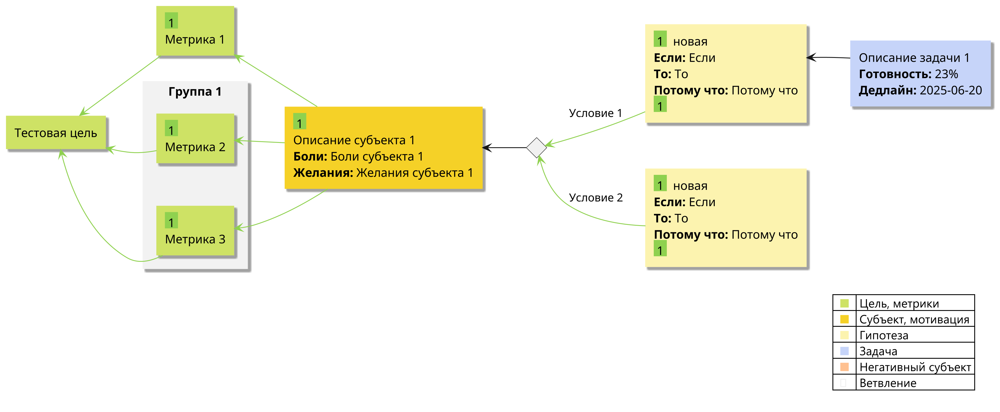

# HypothesisMap-PlantUML

PlantUML библиотека для визуализации **Карт гипотез** по технологии Александра Бындю.

## О проекте

Карта гипотез – технология создания стратегии. 

Данная библиотека предоставляет готовые макросы PlantUML для создания Карт гипотез с автоматическими связями.

## Основные элементы

### Базовые элементы методологии

- **Цель (Goal)** — что мы хотим достичь
- **Субъект (Subject)** — на кого направлена цель, кто получает пользу
- **Гипотеза (Hypothesis)** — предположение о том, как достичь цели
- **Задача (Task)** — конкретные действия для проверки гипотезы
- **Метрика (Metric)** — способ измерения результата
- **Ветвление (Decision)** — элемент условного выбора между альтернативами

### Автоматические связи

Библиотека автоматически создает связи между элементами:
- Subject → Goal(s): стрелка "влияет на" с силой влияния
- Task → Hypothesis: стрелка "реализует"
- Metric → Goal: стрелка "измеряет" с силой влияния
- Hypothesis → Goal(s)/Subject(s): стрелка "поддерживает" с силой влияния
- Elements → Decision: стрелки к ветвлению с подписями

### Система приоритетов

- **0** = без приоритета (стандартные связи)
- **1** = низкий (зеленые тонкие стрелки)
- **2** = средний (желтые средние стрелки)
- **3** = высокий (красные толстые стрелки)

## Быстрый старт

### 1. Подключение библиотеки

```plantuml
@startuml
!include HypothesisMap.puml

' Ваша диаграмма здесь

@enduml
```

### 2. Базовый пример

```plantuml
@startuml
!include https://raw.githubusercontent.com/ChS23/HypothesisMap-PlantUML/main/HypothesisMap.puml

Goal(G1, "Тестовая цель")

Metric(M1, G1, "Метрика 1", 1)
Group(Group1, "Группа 1") {
    Metric(M2, G1, "Метрика 2", 1)
    Metric(M3, G1, "Метрика 3", 1)
}

Subject(S1, "M1;M2;M3", "Описание субъекта 1", "Боли субъекта 1", "Желания субъекта 1", 1)

Decision(D1, S1)

Hypothesis(H1, "D1:Условие 1", "Если", "То", "Потому что", 1, 1, "новая")
Hypothesis(H2, "D1:Условие 2", "Если", "То", "Потому что", 1, 1, "новая")

Task(T1, H1, "Описание задачи 1", 23, "2025-06-20")

SHOW_LEGEND()
@enduml
```



## Справочник API

### Основные элементы

#### Goal - Цель
```plantuml
Goal(alias, название_цели, метрики?, балансирующие_метрики?)
```
**Пример:**
```plantuml
Goal(G1, "Увеличить продажи на 25%", "Конверсия;Выручка", "Качество продукта")
```

#### Subject - Субъект
```plantuml
Subject(alias, targets, описание, боли, желания, influence)
```
**Где:**
- `targets`: цели, на которые влияет субъект ("goal1" или "goal1,goal2,goal3")
- `influence`: сила влияния (1-3)

**Пример:**
```plantuml
Subject(S1, "G1", "Менеджер по продажам", "Низкая мотивация", "Четкие цели", 2)
```

#### NegativeSubject - Негативный субъект
```plantuml
NegativeSubject(alias, targets, описание, боли, желания, influence)
```
**Пример:**
```plantuml
NegativeSubject(NS1, "G1", "Конкуренты", "Агрессивная реклама", "Захват рынка", 3)
```

#### Hypothesis - Гипотеза
```plantuml
Hypothesis(alias, targets, если, то, потому_что, influence, cost?, status?, reason?)
```
**Где:**
- `targets`: цели или субъекты ("goal1" или "goal1,subject1,goal2")
- `influence`: сила влияния (1-3)
- `status`: "новая" 🆕, "сработала" ✅, "отклонена" ❌

**Пример:**
```plantuml
Hypothesis(H1, "G1", "Если запустим акцию", "То увеличим продажи", "Потому что привлечем клиентов", 2, 1, "новая")
```

#### Task - Задача
```plantuml
Task(alias, target, описание, готовность?, дедлайн?)
```
**Где:**
- `target`: гипотеза, которую реализует задача
- `готовность`: процент выполнения (0-100)

**Пример:**
```plantuml
Task(T1, "H1", "Создать промо-материалы", 75, "2024-03-01")
```

#### Metric - Метрика
```plantuml
Metric(alias, target, описание, influence)
```
**Где:**
- `target`: цель, которую измеряет метрика

**Пример:**
```plantuml
Metric(M1, "G1", "Конверсия лидов", 3)
```

#### Decision - Ветвление
```plantuml
Decision(alias, from_targets, условие?)
```
**Где:**
- `from_targets`: элементы, которые приводят к ветвлению
- Подписи создаются через targets других элементов в формате "alias:подпись"

**Пример:**
```plantuml
Decision(D1, "S1", "Бюджет >100к?")
Hypothesis(H1, "D1:Да - большой бюджет", "Если...", "То...", "Потому что...", 3)
Hypothesis(H2, "D1:Нет - малый бюджет", "Если...", "То...", "Потому что...", 2)
```

### Дополнительные возможности

#### Group - Группировка
```plantuml
Group(alias, "Название", цвет?) {
    Элементы
}
```
**Пример:**
```plantuml
Group(Group1, "Безопасность", 2) {
    Metric(M1, G1, "Здоровье", 2)
    Metric(M2, G1, "Стабильность", 3)
}
```

#### Настройки макета
```plantuml
LAYOUT_LEFT_TO_RIGHT()  ' Горизонтальный макет
SHOW_LEGEND()           ' Отображение легенды
```

## Цветовая схема (официальный стандарт)

| Элемент | Цвет фона | Описание |
|---------|-----------|----------|
| Цель, метрики | #cee265 | Светло-зеленый |
| Субъект, мотивация | #f5d127 | Желтый |
| Гипотеза | #fcf3af | Светло-желтый |
| Задача | #c6d4f9 | Светло-синий |
| Негативный субъект | #ffc191 | Светло-оранжевый |
| Ветвление | #f0f0f0 | Светло-серый ромб |

## Приоритеты связей

| Приоритет | Цвет | Толщина | Применение |
|-----------|------|---------|------------|
| Высокий (3) | #f24725 | 6 | Критически важные связи |
| Средний (2) | #fef444 | 4 | Важные связи |
| Низкий (1) | #8fd14f | 1 | Менее важные связи |
| Без приоритета (0) | #171717 | 1 | Обычные связи |

## Примеры

Полный пример см. в файле `example.puml`.

## Совместимость

- PlantUML v1.2021.6+
- Поддержка смешанных диаграмм (allowmixing)
- Автоматическая настройка макета left-to-right

## Лицензия

MIT License
